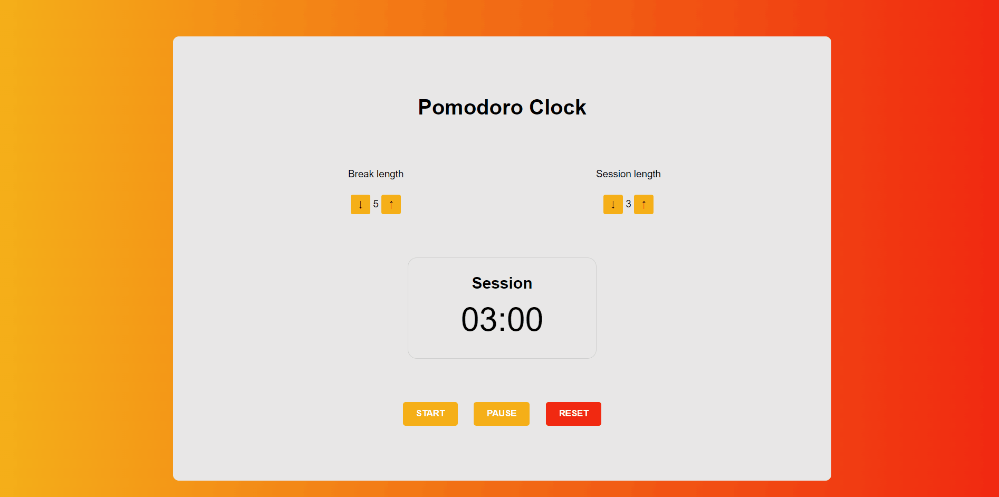

# Pomodoro Clock App

Simple and effective tool designed to help users manage their time and boost productivity. The app is based on the Pomodoro technique, a time management method that uses timed intervals to break work into smaller, more manageable segments. User can define session and break length, start/pause/resume/reset the counter.

## Tech Stack

HTML, SASS and Javascript.

## Live Demo

www.tobeworked.com

#### Showcase

## Installation

Simply clone the repo and run the html file on the browser. If you wish to make any changes to the scss file, install a SASS compiler on the code editor of your preference.

## Support

For support, please email pedroenriquedev@gmail.com.
